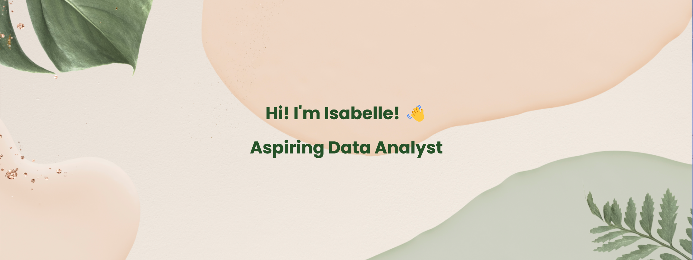

## About me 👋🏾

- I am interested in **data analytics** and **data science** 🖥️
- My programming languages are **Python, R and SQL** 🗣️
- I am looking to collaborate on projects invoving **data exploratory analyses, data visualisation and machine learning** 👯

## Projects 🗃️

Here are a few projects I've worked on:

- [TMDB Movies Data Exploration](https://github.com/IsabelleRaj/TMDB-Movies-Data-Exploration) | Python
- [COVID-19 Data Exploration](https://github.com/IsabelleRaj/COVID-19-Exploration) | SQL | Tableau
- [Life Expectancy Predictive Modelling](https://github.com/IsabelleRaj/Life-Expectancy-Prediction) | Python
- [Mood-based Song Recommendation System](https://github.com/IsabelleRaj/Mood-Based-Song-Recommendation) | Python
- [Customer Churn Predictive Modelling](https://github.com/IsabelleRaj/Swan-Consulting) | Python

## Contact Me ☎️

Feel free to connect with me through the following channels:

- **LinkedIn:** [Isabelle Rajendiran](https://www.linkedin.com/in/isabelle-rajendiran/)
- **GitHub:** [IsabelleRaj](https://github.com/IsabelleRaj)
- **Email:** [isabellerajendiran@ymail.com](mailto:isabellerajendiran@ymail.com)

Don't hesitate to reach out to me! I'm always open to new opportunities and collaborations 😄.

## GitHub Statistics 📊

#### Credits to [Freepik](https://www.freepik.com/) from which my banner was edited from.
